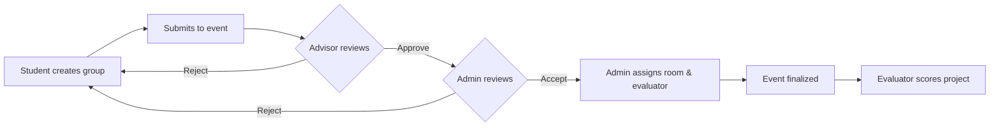

# 🎓 Enterprise University Event Management System

<div align="center">
  
  
  
  
  
</div>

<br/>

> A full-stack, multi-role university event management platform built for **FYP (Final Year Project) showcase days**. It orchestrates the entire lifecycle — from group registration and advisor approval, through room & evaluator assignment, to live scoring — across a beautiful, role-aware web dashboard.

---

## ✨ Highlights

| | Feature | Description |
|---|---|---|
| 🔐 | **4-Role System** | Students, Advisors, Evaluators, and Admins each get a tailored dashboard |
| 📝 | **Multi-Stage Pipeline** | `Draft → Submitted → Advisor Review → Admin Review → Room Assigned → Scheduled → Evaluated` |
| 🏢 | **Smart Room Assignment** | Cascading `Building → Floor → Room` dropdowns with capacity tracking |
| ⭐ | **Rubric Scoring** | 5-criteria evaluation (Technical, Presentation, Innovation, Completeness, Q&A) |
| 📂 | **File Management** | Upload documents, banners, source code; download all as ZIP |
| 📊 | **Audit Trail** | Every create/update/delete is automatically logged with full before/after JSON diffs |
| 🔔 | **Notifications** | In-app bell with read/unread tracking and "Clear All" |
| 🔍 | **Instant Search & Filter** | Zero-latency client-side filtering on all major views |

---

## 🏗️ Architecture

```
EventManagmentProject/
├── backend-api/              # ASP.NET Core Web API  (Port 5287)
│   ├── Controllers/          # Auth, Events, Submissions, Evaluations, AuditLogs, Dashboard
│   ├── Data/                 # AppDbContext + EF Core seeding + audit interceptor
│   ├── Models/               # Entities (IAuditable, AuditLog, etc.)
│   ├── Services/             # JWT auth service
│   ├── Hubs/                 # SignalR dashboard hub
│   └── Dtos/                 # Data transfer objects
├── web/                      # ASP.NET Core MVC Dashboard  (Port 5182)
│   ├── Controllers/          # AppController (all UI actions)
│   ├── Views/App/            # Home, Events, Groups, Submissions, Scores, Settings, AuditLogs
│   ├── Views/Shared/         # _Layout.cshtml (sidebar + topbar)
│   └── wwwroot/              # CSS, JS, uploads
├── mobile/                   # Flutter app (Student & Evaluator)
├── tests/                    # xUnit backend tests
└── db/                       # SQL schema scripts
```

---

## 👥 Roles & Responsibilities

| Role | Platform | What They Do |
|:---|:---|:---|
| 👨‍🎓 **Student** | Web + Mobile | Create groups (≤3 members), upload project files, submit to events, acknowledge feedback |
| 🧑‍🏫 **Advisor** | Web | Review submissions, approve or reject with written feedback |
| 🛡️ **Admin** | Web | Create events, manage domains, assign rooms & evaluators, finalize events, view audit logs |
| ⭐ **Evaluator** | Web + Mobile | Score assigned projects on a 1–5 rubric, provide detailed thoughts |

---

## 🔄 Core Workflow



1. **Create** — Admin creates an event, selects floors, and configures timeslots.
2. **Submit** — Student leader creates a group, adds members, uploads files, and submits.
3. **Advise** — Advisor approves or rejects (reason required). Student must acknowledge rejection.
4. **Administer** — Admin accepts or rejects; assigns a room and an evaluator.
5. **Finalize** — Admin locks the event; all assigned evaluators are notified.
6. **Evaluate** — Evaluator scores the project across 5 criteria. Scores visible to Admin & Advisor.

---

## 🚀 Quick Start

### Prerequisites

- [.NET 10 SDK](https://dotnet.microsoft.com/download)
- SQL Server (LocalDB works out of the box)
- [Flutter SDK](https://flutter.dev/docs/get-started/install) *(optional, for mobile app)*

### Option A — One-Click Launch (Windows)

```bash
start_app.bat
```

This starts both the API and web app in separate terminals automatically.

### Option B — Manual

**Terminal 1 — Backend API:**
```bash
cd backend-api
dotnet restore
dotnet run --launch-profile http
# → http://localhost:5287
```

**Terminal 2 — Web Dashboard:**
```bash
cd web
dotnet restore
dotnet run --launch-profile http
# → http://localhost:5182
```

> **Note:** The database is created and seeded automatically on first run via EF Core migrations. No manual SQL scripts needed.

---

## 🔐 Demo Credentials

| Role | Email | Password |
|:---|:---|:---|
| 🛡️ Admin | `admin@fyp.local` | `Admin@123` |
| 🧑‍🏫 Advisor | `advisor.ai@fyp.local` | `Advisor@123` |
| ⭐ Evaluator | `eval.ai@fyp.local` | `Eval@123` |
| 👨‍🎓 Student | `student@fyp.local` | `Student@123` |

---

## 📊 Database Schema

| Entity | Purpose | Auditable |
|:---|:---|:---:|
| `Users` | All platform users with role assignments | — |
| `Roles` | Admin, Advisor, Evaluator, Student | — |
| `Domains` | Academic domains (AI, Networking, etc.) | — |
| `Buildings` / `Floors` / `Rooms` | Physical location hierarchy | — |
| `Events` | Showcase events with timeslot config | ✅ |
| `ProjectGroups` | Student groups with members | ✅ |
| `ProjectSubmissions` | Event submissions with multi-stage status | ✅ |
| `Evaluations` | Rubric scores per submission | ✅ |
| `Notifications` | Per-user in-app notifications | — |
| `AuditLogs` | Full change history (who, what, when, old/new JSON) | — |

> ✅ = Tracks `ModifiedByUserId` and `UpdatedAt` automatically via `IAuditable` interface.

---

## 🛡️ Audit Logging

Every database change is automatically captured — zero manual effort.

- **What's tracked:** Action (Added/Modified/Deleted), table name, primary key, full old & new values as JSON
- **Who:** The authenticated user's ID is extracted from the JWT token automatically
- **Where to view:** Admin sidebar → **Audit Logs** page (bright red icon at the bottom)
- **Human-readable:** Actions are translated to plain English (e.g., *"Created a new Project Group"*)

---

## 🧪 Testing

```bash
dotnet test tests/BackendApi.Tests
```

---

## 📁 Key Files Reference

| Area | File | Purpose |
|:---|:---|:---|
| **Entities** | `backend-api/Models/Entities.cs` | All domain models, `IAuditable`, `AuditLog` |
| **DB Context** | `backend-api/Data/AppDbContext.cs` | EF Core config, seeding, audit interceptor |
| **Auth** | `backend-api/Services/AppServices.cs` | JWT token generation |
| **Dashboard API** | `backend-api/Controllers/DashboardController.cs` | Role-based metric aggregation |
| **Audit API** | `backend-api/Controllers/AuditLogsController.cs` | Admin-only audit log retrieval |
| **Web Controller** | `web/Controllers/AppController.cs` | All UI actions (40+ endpoints) |
| **Layout** | `web/Views/Shared/_Layout.cshtml` | Sidebar, topbar, notifications |
| **Styles** | `web/wwwroot/css/site.css` | Full design system |
| **Client Logic** | `web/wwwroot/js/site.js` | Search, filters, toasts |

---

## 📝 Related Documentation

| Document | Description |
|:---|:---|
| [`HOW_TO_RUN.md`](HOW_TO_RUN.md) | Detailed setup and run instructions |
| [`APP_FLOW_AND_PLANS.md`](APP_FLOW_AND_PLANS.md) | Application flow, feature status, and improvement roadmap |
| [`lastnight.md`](lastnight.md) | Complete project changelog |

---

<div align="center">
  <br/>
  <i>Built for University Final Year Project Showcases</i>
  <br/>
  <sub>ASP.NET Core · Entity Framework Core · SQL Server · Razor MVC · SignalR</sub>
  <br/><br/>
  <a href="https://github.com/sheralisaleem/enterprise-university-management-system">⭐ Star this repo on GitHub</a>
</div>
